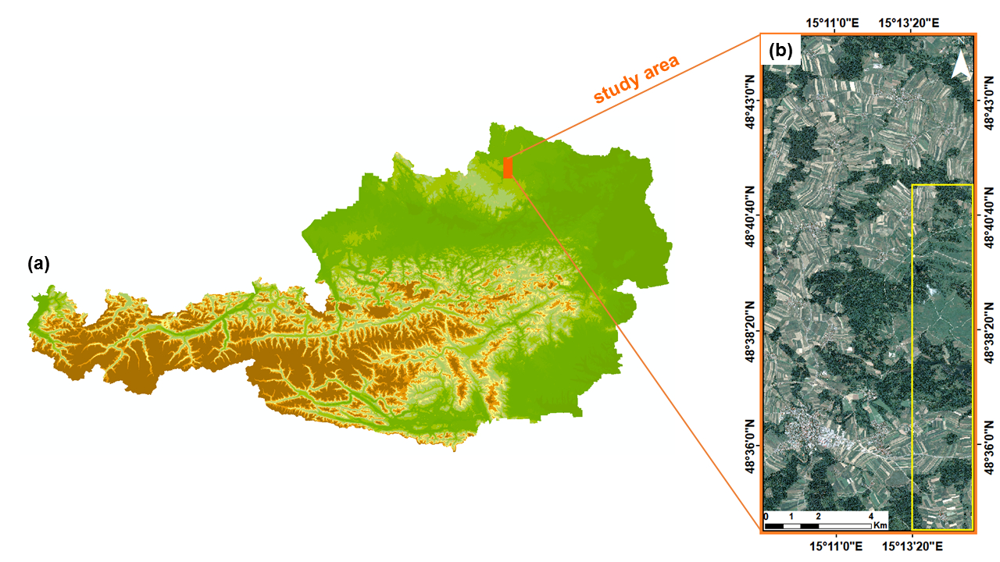
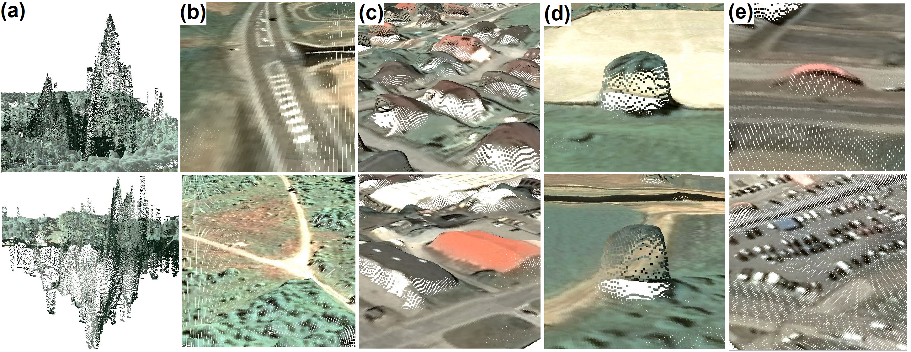

# Semantic Segmentation of Point Clouds Derived from Tri-Stereo Pleiades Satellite Imagery with Generalized Sparse Convolutional Neural Networks

<p align="center">
    
</p>

We study the utility of point clouds derived from tri-stereo satellite imagery for semantic segmentation with Generalized Sparse Convolutional Neural Networks. In particular, we examine if the geometric information, additional to color, has an influence on the segmentation performance for segmenting clutter, roads, buildings, trees, and vehicles. In this regard, we train a Convolutional Neural Network that uses generalized sparse convolution one time solely on geometric information, and one time on geometric as well as color information. Our study area is located in Waldviertel (Forest Quarter), a region in Lower Austria.  With elevations ranging from a minimum of 572 m a.s.l. to a maximum of 749 m a.s.l., the territory is a hilly region covered mainly by forests, agricultural- and grass-lands. Pléades, an European Very High Resolution (VHR) satellite systems, captured the study area late morning of June 13th 2017, around 10:10 a.m. in North-South direction.  We compare the point cloud segmentation results in two ways. First, we compare it with the performance of a convolutional neural network that that was only trained on color. Second, we compare these results with strong baselines. Additionally, we report, inter alia, the F1 score, Kappa coefficient, and Jaccard Index.

<p align="center">
    
</p>

Waldviertel, Lower Austria: (a) Overview map of Austria with marked location of study area; (b) Pléiades orthophoto of Waldviertel; the selected area used for semantic segmentation is marked with yellow.


<p align="center">
    
</p>

Examples of point clouds derived form tri-stereo satellite imagery for each class: (a) Clutter; (b) Roads; (c) Buildings; (c) Trees; (e) Vehicles.

# Requirements
- Ubuntu 14.04 or higher
- Python 3.6 or higher
- CUDA 10.0 or higher
- pytorch 1.2 or higher

# Installation
We recommend that you use [anaconda](https://docs.conda.io/projects/conda/en/latest/user-guide/install/index.html) to separate the environment.


The following command creates the conda environment ```py3-mink``` and installs the necessary python dependencies.
```sh
conda env create -f py3-mink.yml
```
To install the Minkowski Engine in the created environment run
```sh
conda activate py3-mink
sh install_minkowski_engine.sh
```

# How to make a prediction

```py
import torch
import MinkowskiEngine as ME

# For loading LiDar files
from laspy.file import File


device = torch.device('cuda' if torch.cuda.is_available() else 'cpu')


def predict(model, features, coordinates):
    '''
        Takes the given model and returns its predictions for the given features,
        and coordinates. Note that only the features are used for making the predictions.

        The predictions are sent back to the cpu and returned as a numpy array.
    '''
    model.eval()
    model.to(device)

    point_cloud = ME.SparseTensor(features, coords=coordinates).to(device)

    with torch.no_grad():
        loss = model(point_cloud)

    _, y_pred = torch.max(loss.F, dim=1)

    return y_pre.cpu().numpy()


def load_point_cloud(path_to_point_cloud):
    '''
        Opens a point_cloud in read mode.
    '''
    return File(path_to_point_cloud, mode="r")


def load_coordinates_from_point_cloud(path_to_point_cloud):
    '''
        Returns a numpy array for the point clouds coordinates.
    '''
    point_cloud = load_point_cloud(path_to_point_cloud=path_to_point_cloud)
    coordinates = np.vstack([point_cloud.X, point_cloud.Y, point_cloud.Z]).transpose()
    return coordinates


def normalize_coordinates(coordinates, denominator=10000):
    '''
        Normalizes the given coordinates, i.e. all coordinates are then in the range
        [0, 1].
    '''
    return np.divide(coordinates, denominator)


model = torch.hub.load('MacOS/ReKlaSat-3D', 'coordinates')
coordinates = load_coordinates_from_point_cloud(path_to_point_cloud="./data/my_point_cloud.laz")
features = normalize_coordinates(coordinates=coordinates)
y_pre = predict(model=model, features=features, coordinates=coordinates)
```


# Examples

## Get a list of all entrypoints we provide

```py
import torch

entrypoints = torch.hub.list('MacOS/ReKlaSat-3D', force_reload=True)

print(entrypoints)
```


## Load the coordinates Convolutional Neural Network

```py
import torch

model = torch.hub.load('MacOS/ReKlaSat-3D', 'coordinates')
```

```py
import torch

model = torch.hub.load('MacOS/ReKlaSat-3D', 'coordinates_epoch', epoch=40)
```

## Load the coordinates and colors Convolutional Neural Network

```py
import torch

model = torch.hub.load('MacOS/ReKlaSat-3D', 'coordinates_colors')
```

```py
import torch

model = torch.hub.load('MacOS/ReKlaSat-3D', 'coordinates_colors_epoch', epoch=40)
```

## Only get MinkUNet34C

```py
import torch

model = torch.hub.load('MacOS/ReKlaSat-3D', 'get_minkunet34c')
```


# Authors by Institution

## Vienna University of Economics and Business
[Assoc. Prof. Dr. Ronald Hochreiter (Projekt Manager)](https://scholar.google.at/citations?hl=de&user=NdGSq4EAAAAJ)

[BSc. (WU) Andrea Siposova](https://at.linkedin.com/in/andrea-siposova)

[BSc. (WU) Niklas Schmidinger](https://github.com/nsmdgr)

[BSc. (WU) Stefan Bachhofner](https://scholar.google.at/citations?hl=de&user=-WZ0YuUAAAAJ)

## Vienna University of Technology
[Univ.Prof. Dipl.-Ing. Dr.techn. Pfeifer Norbert](https://scholar.google.at/citations?user=-HuwYEMAAAAJ&hl=en)

[MSc. Ana-Maria Loghin](https://scholar.google.at/citations?hl=en&user=E_HkvF8AAAAJ&view_op=list_works)

[Dipl.-Ing. Dr.techn. Johannes Otepka-Schremmer](https://www.geo.tuwien.ac.at/staff/1013/otepka-schremmer-johannes)

## Siemens AG Austria
[Dr. Michael Hornacek](https://scholar.google.at/citations?user=llItOJ8AAAAJ&hl=en)

[Dr. Olaf Kähler](http://www.robots.ox.ac.uk/~olaf/)

## Vermessung Schmid ZT GmbH
[Mag. Nikolaus Schiller](https://at.linkedin.com/in/nikolaus-schiller-37921418)


# Projekt Partners
[Vienna University of Economics and Business, Research Institute for Computational Methods. (Projet Coordinator)](https://www.wu.ac.at/en/firm)

[Vienna University of Technology, Department of Geodesy and Geoinformation.](https://www.geo.tuwien.ac.at/)

[Siemens AG Österreich, Corporate Technology.](https://new.siemens.com/at/de.html)

[Vermessung Schmid ZT GmbH.](http://www.geoserve.co.at/)

[Federal Ministry of Defence, Austria.](http://www.bundesheer.at/english/index.shtml)

# Funding
This research was funded by the Austrian Research Promotion Agency (FFG) project [“3D Reconstruction and Classification from Very High Resolution Satellite Imagery (ReKlaSat 3D)” (grant agreement No. 859792)](https://projekte.ffg.at/projekt/1847316).
