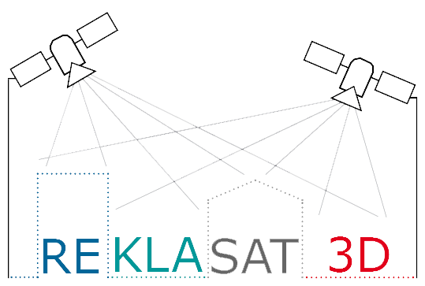

# Generalized Sparse Convolutional Neural Networks for Semantic Segmentation of Point Clouds Derived from Tri-Stereo Satellite Imagery

<p align="center">
    
</p>

This GitHub repository contains the machine learning models described in Stefan Bachhofner, 
Ana-Maria Loghin, 
Michael Hornacek, 
Johannes Otepka, 
Andrea Siposova, 
Niklas Schmindinger, 
Norbert Pfeiffer, 
Kurt Hornik, 
Nikolaus Schiller, 
Olaf Kähler, 
Ronald Hochreiter:
Generalized Sparse Convolutional Neural Networks for Semantic Segmentation of Point Clouds Derived from Tri-Stereo Satellite Imagery. **This paper is currently under review**

# Table of Contents
**[1. Instructions](#instructions)**<br>
**[1.1 Installation Instructions](#installation-instructions)**<br>
**[1.2 Usage Instructions](#usage-instructions)**<br>
<br>
**[2. Paper](#paper)**<br>
**[2.1 Abstract](#abstract)**<br>
**[2.3 Tables and Figures](#tables-and-figures)**<br>
**[2.3.1 Segmentation Results](#segmentation-results)**<br>
**[2.3.2 Study Area](#study-area)**<br>
<br>
**[3. General Information](#general-information)**<br>
**[3.1 Authors by Institution](#authors-by-institution)**<br>
**[3.2 Project Partners](#project-partners)**<br>
**[3.3 Funding](#funding)**<br>


# Instructions

## Installation Instructions

### Requirements
- Ubuntu 14.04 or higher
- Python 3.6 or higher
- CUDA 10.0 or higher
- pytorch 1.2 or higher

### Installation
We recommend that you use [anaconda](https://docs.conda.io/projects/conda/en/latest/user-guide/install/index.html) to separate the environment.


The following command creates the conda environment ```py3-mink``` and installs the necessary python dependencies.
```sh
conda env create -f py3-mink.yml
```
To install the [Minkowski Engine](https://github.com/StanfordVL/MinkowskiEngine#installation) in the created environment run
```sh
conda activate py3-mink
sh install_minkowski_engine.sh
```

## Usage Instructions

```py
import torch
import MinkowskiEngine as ME

# For loading LiDar files
from laspy.file import File


device = torch.device('cuda' if torch.cuda.is_available() else 'cpu')


def predict(model, features, coordinates):
    '''
        Takes the given model and returns its predictions for the given features,
        and coordinates. Note that only the features are used for making the predictions.

        The predictions are sent back to the cpu and returned as a numpy array.
    '''
    model.eval()
    model.to(device)

    point_cloud = ME.SparseTensor(features, coords=coordinates).to(device)

    with torch.no_grad():
        loss = model(point_cloud)

    _, y_pred = torch.max(loss.F, dim=1)

    return y_pre.cpu().numpy()


def load_point_cloud(path_to_point_cloud):
    '''
        Opens a point_cloud in read mode.
    '''
    return File(path_to_point_cloud, mode="r")


def load_coordinates_from_point_cloud(path_to_point_cloud):
    '''
        Returns a numpy array for the point clouds coordinates.
    '''
    point_cloud = load_point_cloud(path_to_point_cloud=path_to_point_cloud)
    coordinates = np.vstack([point_cloud.X, point_cloud.Y, point_cloud.Z]).transpose()
    return coordinates


def normalize_coordinates(coordinates, denominator=10000):
    '''
        Normalizes the given coordinates, i.e. all coordinates are then in the range
        [0, 1].
    '''
    return np.divide(coordinates, denominator)


model = torch.hub.load('MacOS/ReKlaSat-3D', 'coordinates')
coordinates = load_coordinates_from_point_cloud(path_to_point_cloud="./data/my_point_cloud.laz")
features = normalize_coordinates(coordinates=coordinates)
y_pre = predict(model=model, features=features, coordinates=coordinates)
```


# Examples

## Get a list of all entrypoints we provide

```py
import torch

entrypoints = torch.hub.list('MacOS/ReKlaSat-3D', force_reload=True)

print(entrypoints)
```


## Load the coordinates Convolutional Neural Network

```py
import torch

model = torch.hub.load('MacOS/ReKlaSat-3D', 'coordinates')
```

```py
import torch

model = torch.hub.load('MacOS/ReKlaSat-3D', 'coordinates_epoch', epoch=40)
```

## Load the coordinates and colors Convolutional Neural Network

```py
import torch

model = torch.hub.load('MacOS/ReKlaSat-3D', 'coordinates_colors')
```

```py
import torch

model = torch.hub.load('MacOS/ReKlaSat-3D', 'coordinates_colors_epoch', epoch=40)
```

## Load the coordinates and colors Convolutional Neural Network that were trained with median class weights.

```py
import torch

model = torch.hub.load('MacOS/ReKlaSat-3D', 'coordinates_colors_weighted')
```

```py
import torch

model = torch.hub.load('MacOS/ReKlaSat-3D', 'coordinates_colors_weighted_epoch', epoch=149)
```

## Only get MinkUNet34C

```py
import torch

model = torch.hub.load('MacOS/ReKlaSat-3D', 'get_minkunet34c')
```


# Paper

## Abstract

We study the applicability of point clouds derived from tri-stereo satellite imagery for semantic segmentation for generalized sparse convolutional neural networks by the example of an Austrian study area. We examine, in particular, if the distorted geometric information, additional to color, influences the performance of segmenting clutter, roads, buildings, trees, and vehicles. In this regard, we train a fully convolutional neural network that uses generalized sparse convolution one time solely on 3D geometric information (i.e. 3D point cloud derived by dense image matching), and two times on 3D geometric as well as color information. In the first experiment we don't use class weights, in the second we do. We compare the results with a fully convolutional neural network that is trained on the 2D orthophoto, and a decision tree that is once trained on hand-crafted 3D geometric features, and once trained on hand-crafted 3D geometric as well as color features. The decision tree using hand-crafted features had been successfully applied to aerial laser scanning data in the literature. Hence, we compare our main interest of study, an unsupervised feature learning technique, with another unsupervised feature learning technique, and a supervised feature learning technique. Our study area is located in Waldviertel, a region in Lower Austria. The territory is a hilly region covered mainly by forests, agricultural- and grass-lands. Our classes of interest are heavily unbalanced. However, we do not use any data augmentation techniques to counter overfitting. For our study area we report that geometric and color information does only improve the performance of the Generalized Sparse Convolutional Neural Network (GSCNN) on the dominant class, which leads to a higher overall performance in our case. We also find that training the network with median class weighting partially reverts the effects of adding color. The network also started to learn the classes with lower occurrences. The fully convolutional neural network that is trained on the 2D orthophoto generally outperforms the other two with a kappa score of over 90\% and an average per class accuracy of 61\%. Whereas, the decision tree trained on colors and coordinates has a 2\% higher accuracy for roads.


## Tables and Figures

### Segmentation Results
Quantitative overall comparison of the GSCNN, FCN-8s, and the decision tree. We use six conventionally used metrics obtained from the segmentation results. We highlight the best values for each metric (hence in each column) in **bold**. And the best values among the GSCNN models in *italic*. Please see the paper for a class level comparison.

| Models | Avg. Precision | Avg. Recall | Avg. F1 | Kappa | OA | Avg per Class Acc. |
|:-------|:----------:|:--------:|:---:|:-------:|:----:|:--------------------:|
|        | %        | %      | %  | %     | %  |                    |
| baseline A | 12.85 | 20.00 | 15.64 | 47.33 | 64.25 | 20.00 |
| **U-Net based GSCNN (3D)** | | | | | | | |
| &nbsp;&nbsp;&nbsp;&nbsp;&nbsp;&nbsp; Coordinates               | *23.69* | *24.33* | *23.30* | *38.90* | *56.01* | *24.32* |
| &nbsp;&nbsp;&nbsp;&nbsp;&nbsp;&nbsp; Coordinates, Colors       | 19.31 | 19.98 | 17.38 | 45.07 | 62.14 | 19.97 |
| &nbsp;&nbsp;&nbsp;&nbsp;&nbsp;&nbsp; Coordinates, Colors, W.L. | 21.92 | 22.24 | 21.36 | 34.30 | 51.07 | 22.22 |
| **FCN-8s (2D)** | | | | | | | |
| &nbsp;&nbsp;&nbsp;&nbsp;&nbsp;&nbsp; Colors | **62.43** | **61.15** | **59.12** | **90.76** | **96.11** | **61.15** |
| **Decision Tree (3D)** | | | | | | | |
| &nbsp;&nbsp;&nbsp;&nbsp;&nbsp;&nbsp; Coordinates         | 43.89 | 38.73 | 39.54 | 82.00 | 89.10 | 38.73 |
| &nbsp;&nbsp;&nbsp;&nbsp;&nbsp;&nbsp; Coordinates, Colors | 61.03 | 58.72 | 58.96 | 86.60 | 93.18 | 58.71 |

Overall accuracy progress over epochs for the GSCNN models. Here, only the first 50 epochs of the model that uses the weighted loss is shown.

<!-- Code taken from https://stackoverflow.com/questions/39777166/display-pdf-image-in-markdown -->
<object data="./overall_accuracy_gscnn_models.pdf" type="application/pdf" width="1080px" height="520px">
    <embed src="./overall_accuracy_gscnn_models.pdf">
        <p>This browser does not support PDFs. Please download the PDF to view it: <a href="./overall_accuracy_gscnn_models.pdf">Download PDF</a>.</p>
    </embed>
</object>


### Study Area
<p align="center">
    
</p>

Waldviertel, Lower Austria: (a) Overview map of Austria with marked location of study area; (b) Pléiades orthophoto of Waldviertel; the selected area used for semantic segmentation is marked with yellow.


<p align="center">
    
</p>

Examples of point clouds derived form tri-stereo satellite imagery for each class: (a) Clutter; (b) Roads; (c) Buildings; (c) Trees; (e) Vehicles.


# General Information

## Authors by Institution

### Vienna University of Economics and Business
[Assoc. Prof. Dr. Ronald Hochreiter (Projekt Manager)](https://scholar.google.at/citations?hl=de&user=NdGSq4EAAAAJ)

[Univ.-Prof. Dr. Kurt Hornik](https://www.wu.ac.at/statmath/faculty-staff/faculty/khornik)

[BSc. (WU) Andrea Siposova](https://at.linkedin.com/in/andrea-siposova)

[BSc. (WU) Niklas Schmidinger](https://github.com/nsmdgr)

[BSc. (WU) Stefan Bachhofner](https://scholar.google.at/citations?hl=de&user=-WZ0YuUAAAAJ)

### Vienna University of Technology
[Univ.Prof. Dipl.-Ing. Dr.techn. Pfeifer Norbert](https://scholar.google.at/citations?user=-HuwYEMAAAAJ&hl=en)

[MSc. Ana-Maria Loghin](https://scholar.google.at/citations?hl=en&user=E_HkvF8AAAAJ&view_op=list_works)

[Dipl.-Ing. Dr.techn. Johannes Otepka-Schremmer](https://www.geo.tuwien.ac.at/staff/1013/otepka-schremmer-johannes)

### Siemens AG Austria
[Dr. Michael Hornacek](https://scholar.google.at/citations?user=llItOJ8AAAAJ&hl=en)

[Dr. Olaf Kähler](http://www.robots.ox.ac.uk/~olaf/)

### Vermessung Schmid ZT GmbH
[Mag. Nikolaus Schiller](https://at.linkedin.com/in/nikolaus-schiller-37921418)


## Project Partners
[Vienna University of Economics and Business, Research Institute for Computational Methods. (Projet Coordinator)](https://www.wu.ac.at/en/firm)

[Vienna University of Technology, Department of Geodesy and Geoinformation.](https://www.geo.tuwien.ac.at/)

[Siemens AG Österreich, Corporate Technology.](https://new.siemens.com/at/de.html)

[Vermessung Schmid ZT GmbH.](http://www.geoserve.co.at/)

[Federal Ministry of Defence, Austria.](http://www.bundesheer.at/english/index.shtml)


## Funding
This research was funded by the Austrian Research Promotion Agency (FFG) project [“3D Reconstruction and Classification from Very High Resolution Satellite Imagery (ReKlaSat 3D)” (grant agreement No. 859792)](https://projekte.ffg.at/projekt/1847316).
